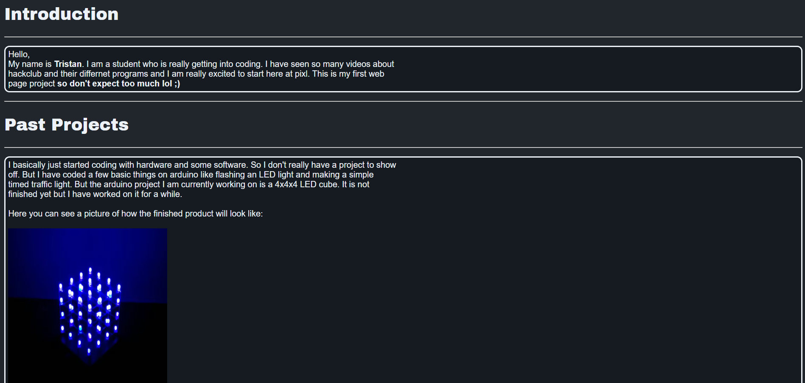
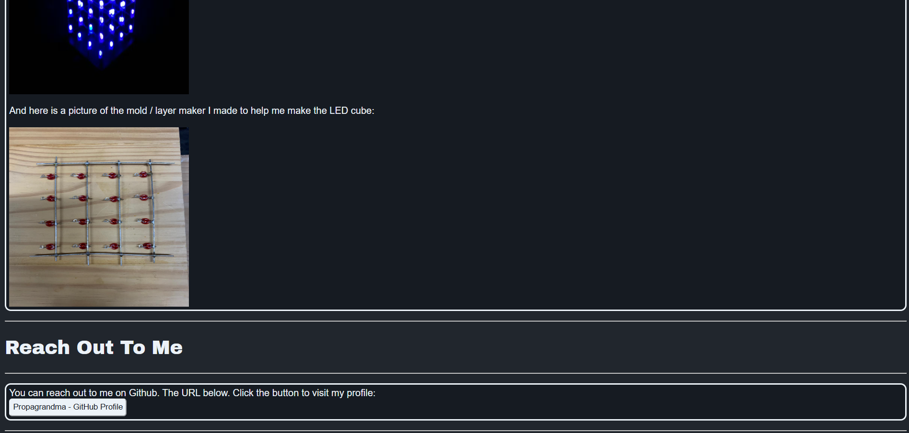

# Tristan's Builder Page
This project is the trail builder page suggested by Pixl HackClub for beginners.

## What it is
This program is a localhosted webpage that consists of an introduction about me, my past projects and how to reach out to me.

## Built with
The program is built with the following languages, tools, version control and hosting platforms. 
- HTML
- CSS
- JavaScript
- VSCode
- Git 
- GitHub
There are no frameworks or libraries used in this program. 

## How to setup and run

### Requirements
To run this program you only need the following:
- Web Browser 
- Project Files
- Git (if you want to run locally)
There are no further things like variables and etc. needed to run this program unless you want to run it on VSCode. 

### Running Locally 
If you want to run the program locally you would need to follow the following steps:
1. Clone the project
To download the code open your terminal and run this command:
```bash
git clone https://github.com/Propagrandma/Builder-Page.git
```
2. Open the newly downloaded project folder
3. Open index.html in a web browser

### Using VSCode
The project can be opened using the Live Server Extension available to download in VSCode.
1. Open the project folder in VSCode
2. Open index.html
3. Right Click on code
4. Select **Open with Live Server**

## Project Structure 
Builder Page/ 
images/ 
- Favicon.png
- Layer_Builder.png
- LED_Cube.png
screenshots/
- WebpageScreenshot1.png
- WebpageScreenshot2.png
- WebTab.png
index.html
readme.md
style.cs

## Screenshots




## Live Demo
[View Tristan's Builder Page](https://propagrandma.github.io/Builder-Page/)